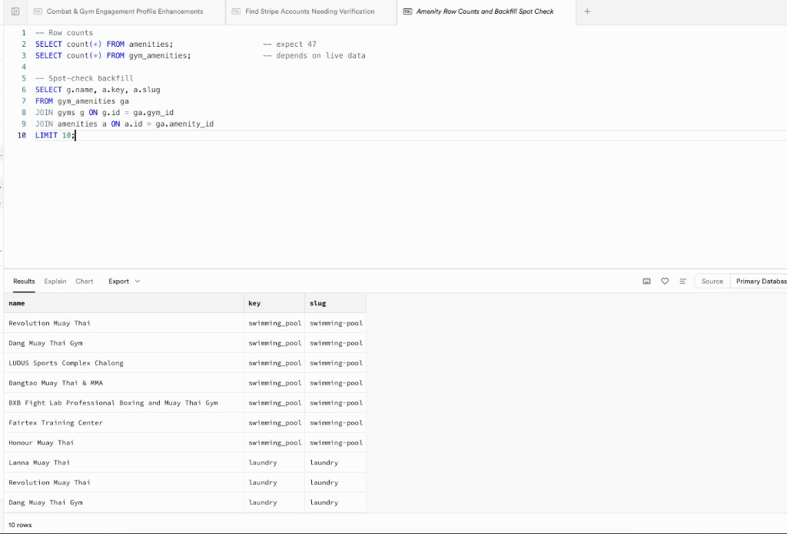

# Programmatic SEO Engine — Architecture & Amenities Normalization

Last updated: 2026-06-05  
Owner: engineering  
Status: **Priority 1 shipped** (amenities tables + backfill). Tier 4 routes and sync trigger **not started**.

This doc is the canonical reference for CombatStay's pSEO architecture and the amenities normalization migration. It supersedes ad-hoc chat notes from the 2026-06-05 planning session.

---

## Why `/blog/` first, not `/train/`

Discovery pages currently live under `/blog/` (e.g. `/blog/best-muay-thai-gyms-phuket`). A `/train/[discipline]/[country]/[city]` hierarchy is cleaner long-term but **do not migrate URLs prematurely** — existing `/blog/` pages with crawl history are worth more than a clean hierarchy with none. Migrate with 301s only when inventory justifies it (500+ gyms, 20+ countries).

---

## URL tier matrix (target state)

| Tier | Pattern | Example | Intent |
|------|---------|---------|--------|
| 1 | `/train/[discipline]` | `/train/muay-thai` | Global discipline |
| 2 | `/train/[discipline]/[country]` | `/train/muay-thai/thailand` | Country hub |
| 3 | `/train/[discipline]/[country]/[city]` | `/train/muay-thai/thailand/phuket` | City landing |
| 4 | `…/[city]/[amenity-slug]` | `/blog/best-muay-thai-gyms/krabi/private-ac-room` | Long-tail amenity |

**Current implementation:** Tiers 2–3 exist under `/blog/`. Tier 4 is partially manual (`app/blog/muay-thai-krabi-private-ac-rooms/page.tsx` filters JSONB in app code). Tier 4 programmatic routes are the next build.

Slugs: singular, lowercase, hyphenated (`muay-thai`, not `MuayThai`).

---

## Amenities data model (shipped 2026-06-05)

### Before

`gyms.amenities` is a **JSONB boolean map**, not a text array:

```json
{ "air_conditioning": true, "wifi": true, "accommodation": false }
```

Keys and labels are curated in `lib/constants/gym-amenities.ts` (`GYM_AMENITY_LABELS`). Owner edits write to this JSONB column only.

### After (read mirror)

Migration: `supabase/migrations/20260605193000_normalize_gym_amenities.sql`

| Table | Purpose |
|-------|---------|
| `public.amenities` | Master catalog: `key` (JSONB key), `name` (UI label), `slug` (SEO URL segment), `category` |
| `public.gym_amenities` | Junction: `gym_id` ↔ `amenity_id` |

**47 rows** seeded from `GYM_AMENITY_LABELS`. SEO slugs differ from keys where needed:

| `key` | `slug` | Notes |
|-------|--------|-------|
| `accommodation` | `with-accommodation` | Tier 4 long-tail |
| `air_conditioning` | `private-ac-room` | Matches existing Krabi blog intent |
| `physiotherapy` | `on-site-physiotherapy` | |
| `meals` | `with-meals` | |
| *(others)* | `key` with `_` → `-` | e.g. `swimming_pool` → `swimming-pool` |

### Backfill logic

Native JSONB booleans only — no string casting:

```sql
INSERT INTO public.gym_amenities (gym_id, amenity_id)
SELECT g.id, a.id
FROM public.gyms g
CROSS JOIN LATERAL jsonb_each(g.amenities) AS kv(key, val)
JOIN public.amenities a ON a.key = kv.key
WHERE kv.val = 'true'::jsonb
ON CONFLICT DO NOTHING;
```

Audit confirmed `jsonb_typeof` = `boolean` and values are unquoted `true`/`false` in production.

### Write path (important)

**`gyms.amenities` JSONB remains the source of truth for owner edits.** The junction table is a read-optimized mirror from the one-time backfill. Until a sync trigger or app-layer hook is added, owner amenity toggles in `/manage/gym/edit` do **not** automatically update `gym_amenities`.

---

## Post-migration verification

Run in Supabase SQL editor after applying the migration:

```sql
-- Row counts
SELECT count(*) FROM amenities;      -- expect 47
SELECT count(*) FROM gym_amenities;  -- depends on live data

-- Spot-check backfill
SELECT g.name, a.key, a.slug
FROM gym_amenities ga
JOIN gyms g ON g.id = ga.gym_id
JOIN amenities a ON a.id = ga.amenity_id
LIMIT 10;
```

**Production sign-off (2026-06-05):** spot-check returned expected joins — e.g. Revolution Muay Thai → `swimming_pool` / `swimming-pool`, Lanna Muay Thai → `laundry` / `laundry`.



---

## Tier 4 query pattern (for next sprint)

When building `/blog/best-muay-thai-gyms/[city]/[amenity]`:

```sql
SELECT g.*
FROM gyms g
JOIN gym_amenities ga ON ga.gym_id = g.id
JOIN amenities a ON a.id = ga.amenity_id
JOIN -- discipline filter (still text[] on gyms for now)
WHERE a.slug = $amenity_slug
  AND g.city ILIKE '%' || $city || '%'
  AND g.country ILIKE '%Thailand%'
  AND g.status = 'approved'
  AND g.verification_status IN ('verified', 'trusted');
```

Only emit sitemap entries and internal footer links when `count > 0` for that matrix cell.

---

## Build priority (remaining)

| Priority | Item | Status |
|----------|------|--------|
| 1 | Normalize amenities tables + backfill | **Done** — migration `20260605193000` |
| 2 | Sync `gym_amenities` on owner amenity save | Not started |
| 3 | Tier 4 programmatic route + metadata templates | Not started |
| 4 | Internal linking matrix footers on city guides | Not started |
| 5 | Auto-generate sitemap from DB (`count > 0` guard) | Not started |
| 6 | `/train/` URL hierarchy migration (301s from `/blog/`) | Deferred |

---

## Related code

| Path | Role |
|------|------|
| `lib/constants/gym-amenities.ts` | Canonical amenity keys + labels (keep in sync with `amenities` seed) |
| `lib/guides/thailand-gyms.ts` | City + discipline guide queries (still uses JSONB / text[], not junction yet) |
| `app/blog/muay-thai-krabi-private-ac-rooms/page.tsx` | Manual Tier 4 prototype (post-filters JSONB) |
| `app/blog/best-muay-thai-gyms/[city]/page.tsx` | Programmatic Tier 3 city route |
| `app/sitemap.ts` | Manually maintained — needs DB-driven generation |

When adding a new amenity to `GYM_AMENITY_LABELS`, also add a row to the `amenities` seed (or a follow-up migration) with `key`, `name`, `slug`, and `category`.
