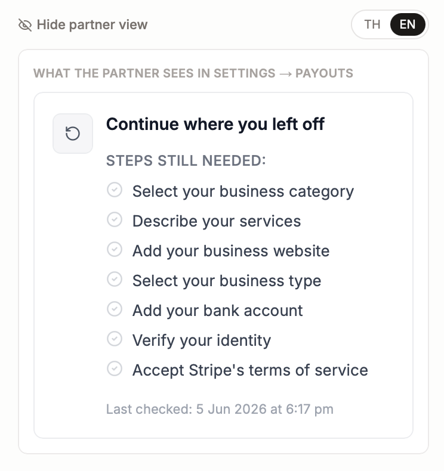
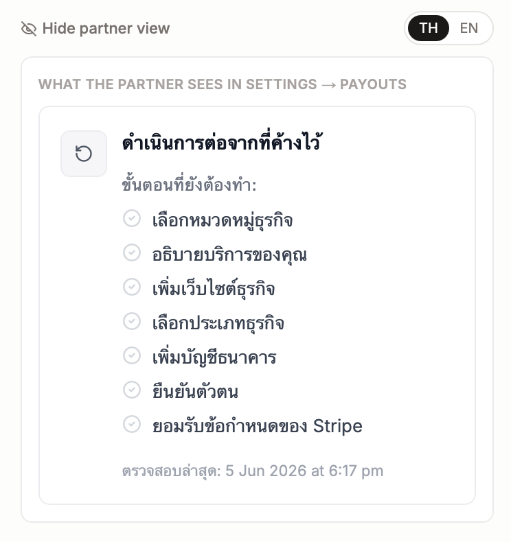

# Stripe Payout Onboarding UX — Implementation Spec

**Status:** P1 + P3 + P4 shipped · P2 blocked on MP4 asset  
**Owner:** Engineering  
**Last updated:** 2026-06-05  
**Related:** `components/manage/manage-payouts-workspace.tsx`, `components/manage/manage-payout-preferences-form.tsx`, `app/api/webhooks/stripe/route.ts`

---

## Goal

Reduce Thai gym partner drop-off at Stripe Connect onboarding (especially authenticator 2FA) by adding pre-drawer guidance, in-flow coaching, recovery UI, and pending-earnings visibility.

---

## Current baseline (do not regress)

| Area | Today |
|------|--------|
| Entry | **Settings → Payouts** (`/manage/settings?tab=payouts&gym_id=…`) — no dashboard "Set Up Payouts" CTA yet |
| CTA | Blue **"Start payout setup"** / **"Continue payout setup"** in `ManagePayoutPreferencesForm` |
| Stripe UI | **Embedded** `ConnectAccountOnboarding` + `ConnectAccountManagement` — **same tab**, Stripe steps in **`overlays: 'drawer'`** |
| Complete when | `gyms.stripe_connect_verified = true` (`charges_enabled && payouts_enabled`) |
| Requirements sync | Webhook writes `stripe_requirements_currently_due` on `account.updated` — **but currently not firing for existing incomplete accounts** (see webhook fix below) |
| Locale | `profiles.preferred_language` (BCP-47) — align to `preferred_language === 'th-TH'`, not `user.locale` |
| Guest payments | Platform PaymentIntent, manual capture — **not** destination-charged to connected account yet |

---

## Go / No-Go per priority

| Priority | Status | Blocker |
|----------|--------|---------|
| **P1** — Pre-drawer gate | ✅ Start now | None |
| **P4** — Pending earnings card | ✅ Start now | None |
| **P3** — Recovery UI | ✅ Shipped · QA signed off 2026-06-05 | — |
| **P2** — Coach panel | 🔴 Blocked | MP4 asset + LINE/WhatsApp env vars |

---

## Progress log

| Date | Item | Notes |
|------|------|-------|
| 2026-06-05 | P1 shipped | Pre-drawer gate, EN/TH copy, localStorage per gym, CTA gated on checkbox |
| 2026-06-05 | Webhook fix shipped | `update-stripe-status` now mirrors full webhook payload (requirements + sync timestamp) |
| 2026-06-05 | P3 shipped | `StripePayoutRecoveryCard` + `stripe-requirements-labels.ts` |
| 2026-06-05 | P3 QA sign-off | Admin partner preview EN/TH — screenshots below |

---

## Critical: Two distinct failure modes

This spec solves **two separate problems**. The team must understand they are not the same:

| Problem | What it is | Where it happens | Surfaces in `currently_due`? | Which priority fixes it |
|---------|-----------|-----------------|------------------------------|------------------------|
| **Authenticator / 2FA drop-off** | Stripe asks the partner to secure their Stripe *login* during the embedded drawer | Stripe's user authentication layer — fires during drawer flow | **No** — this is a Stripe user account security step, not a Connect account requirement | **P1** (pre-drawer gate) |
| **KYC / business info drop-off** | Partner exits before completing identity, bank, or business profile | Connect account requirements | **Yes** — lands in `account.requirements.currently_due` | **P3** (recovery UI) |

`totp.*` has never appeared in production `currently_due` because it is not a Connect requirement — it is a Stripe auth step. **P1 exists precisely because this step is invisible to the recovery card.** Both priorities are necessary; neither replaces the other.

---

## Pre-P3 blocker: requirements sync ✅ fixed

**Root cause found:** The webhook handler (`app/api/webhooks/stripe/route.ts`) was already writing all requirements fields correctly. The problem was `POST /api/gyms/{id}/update-stripe-status` — called from `ConnectAccountOnboarding` `onExit` — only wrote `stripe_connect_verified` and skipped everything else.

**Fix shipped (2026-06-05):** `update-stripe-status` now retrieves the full Stripe account and writes the same payload the webhook writes:
- `stripe_charges_enabled`, `stripe_payouts_enabled`, `stripe_details_submitted`
- `stripe_requirements_currently_due`, `stripe_requirements_pending_verification`, `stripe_disabled_reason`
- `last_stripe_account_sync_at`

Response now also returns `currently_due`, `pending_verification`, `disabled_reason`, `synced_at` so the recovery UI can read them directly from the API response without an extra DB fetch.

**Verify fix:** Run this SQL against RC rachai and Chinnarach after either account's next `onExit` trigger or a manual call to `update-stripe-status`:

```sql
SELECT id, name, stripe_requirements_currently_due,
       stripe_requirements_pending_verification,
       last_stripe_account_sync_at
FROM public.gyms
WHERE stripe_account_id IN ('acct_1TV54mCsWF3mE3nT', 'acct_1TdqEnCXl8C40eJQ');
```

Expect: non-empty arrays and non-NULL timestamp.

**Remaining question:** Why is `account.updated` not firing for these accounts via webhook? Check Stripe Dashboard → Developers → Webhooks for delivery history on both `acct_` IDs. If the webhook is not configured for Connect account events, enable it. The `update-stripe-status` fix means `onExit` will sync correctly regardless — but the webhook should also fire so requirements stay fresh without the partner re-opening the drawer.

---

## Assets & config (prerequisites)

- [ ] **MP4** for QR scan guide — `public/partner/stripe-authenticator-guide.mp4` (see video brief below)
- [ ] **Support env vars** — must be in env **before P2 ships** (coach panel must not ship with hidden links):
  - `NEXT_PUBLIC_PARTNER_LINE_URL`
  - `NEXT_PUBLIC_PARTNER_WHATSAPP_URL`
- [ ] **Copy module** — `lib/manage/stripe-payout-onboarding-copy.ts` (EN + TH strings)

### Video brief for `stripe-authenticator-guide.mp4`

| Field | Spec |
|-------|------|
| Length | **30 seconds maximum**, no audio |
| Device UI | Phone screen in **Thai language** (Thai iOS or Android UI) |
| Show | Open Google Authenticator → tap blue **+** (bottom right) → tap **"สแกน QR code"** → camera view opens |
| Text overlays | `แตะ +` / `เลือก สแกน QR code` / `กล้องจะเปิดขึ้น — ชี้ไปที่ QR code` |
| Export | MP4, muted, **under 5MB**, 1080p or lower |
| Tool | Loom, iOS Screen Record, or any screen recorder |
| Owner | **Seth** — assign before P2 sprint starts. This is a 30-minute task, not a dev task. P2 is the highest-impact in-flow coaching screen and is blocked only by this video. |

If no Thai-language phone is available: switch any Android (or iOS) system language to Thai for the recording (~60 seconds to switch back).

---

## Product decisions (resolved — do not re-open mid-sprint)

| # | Question | Decision |
|---|----------|----------|
| 1 | Persist "I have the app installed" checkbox? | **Yes** — `localStorage` key `combatStay_authenticatorConfirmed_{gymId}` (gym-scoped). Partner returning tomorrow should not re-confirm. |
| 2 | P1 gate on **Start** only or **Continue** too? | **Both.** Continue is where real drop-off happens. |
| 3 | P4 pending earnings TH copy? | Body: `คุณมีรายได้ {amount} จากการจองที่รอการตั้งค่าการรับเงิน` — CTA: `ตั้งค่าการรับเงิน →` |
| 4 | LINE/WhatsApp URLs? | **Must be in env before P2.** Production must have values; dev may hide gracefully if unset. |

---

## Priority 1 — Pre-drawer gate (Settings → Payouts)

### Behavior

Before **"Start payout setup"** / **"Continue payout setup"** is enabled, show an inline block above the CTA:

1. Short explainer: Stripe will ask for an authenticator app (~5 min, one-time).
2. Two deep-link buttons:
   - [Google Authenticator — App Store](https://apps.apple.com/app/google-authenticator/id388497605)
   - [Google Authenticator — Play Store](https://play.google.com/store/apps/details?id=com.google.android.apps.authenticator2)
3. Checkbox: **"I have the app installed"** — required to enable CTA.
4. Locale: Thai when `profile.preferred_language === 'th-TH'`, else English.
5. On check: `localStorage.setItem('combatStay_authenticatorConfirmed_' + gymId, '1')`. On mount, if key present, pre-check and enable CTA.

### Acceptance criteria

- [ ] CTA `disabled` until checkbox checked (and not `savingRail`).
- [ ] Gate shown when `!gym.stripe_connect_verified` — both Start and Continue.
- [ ] Gate stays visible until verified (do not collapse after first check).
- [ ] `localStorage` keyed per `gymId`.

### Files

| File | Change |
|------|--------|
| `components/manage/manage-payout-preferences-form.tsx` | Gate UI + CTA disable + localStorage |
| `lib/manage/stripe-payout-onboarding-copy.ts` | **New** — EN/TH strings |
| `components/manage/manage-payouts-workspace.tsx` | Pass `preferredLanguage` from profile |

### Copy

**EN**
- Title: Before you start — install Google Authenticator
- Body: Stripe will ask you to scan a QR code with this free app. It takes about 5 minutes and is a one-time setup.
- Checkbox: I have Google Authenticator installed on my phone

**TH**
- Title: ก่อนเริ่ม — ติดตั้ง Google Authenticator
- Body: Stripe จะให้สแกน QR code ด้วยแอปฟรีนี้ ใช้เวลาประมาณ 5 นาที และทำครั้งเดียว
- Checkbox: ฉันติดตั้ง Google Authenticator บนมือถือแล้ว

> **TH copy note:** Have a native Thai speaker review `ยืนยันตัวตน` (identity verification) and `ตั้งค่าระบบรหัสความปลอดภัย` (security code setup) before shipping — these carry trust weight with partners.

---

## Priority 2 — Sidebar panel while Stripe drawer is open

### Behavior

When `connectInstance` is truthy and `!gym.stripe_connect_verified`:

| Viewport | Layout |
|----------|--------|
| Desktop (`md+`) | Two-column: left = onboarding card; **right = sticky panel** (~320px), 3-step QR guide |
| Mobile | Panel **below** onboarding section, full width |

**Steps:** (1) Open app → tap + — (2) Scan QR (embed MP4) — (3) Enter 6-digit code in Stripe.

**Footer:** LINE + WhatsApp (env URLs, `target="_blank"`).

Panel z-index **below** Stripe drawer overlay — drawer must stay interactive.

### Acceptance criteria

- [ ] Video: autoplay, muted, loop, `playsInline`.
- [ ] Support links visible when env set; not shipped to prod with missing env.
- [ ] Hidden when verified or Connect unmounts.

### Files

| File | Change |
|------|--------|
| `components/manage/stripe-onboarding-coach-panel.tsx` | **New** |
| `components/manage/manage-payouts-workspace.tsx` | Grid layout + conditional render |
| `public/partner/stripe-authenticator-guide.mp4` | **New** (per video brief above) |

---

## Priority 3 — Recovery UI (incomplete onboarding)

### Trigger

Replace standard incomplete Payouts card when:

```ts
gym.stripe_account_id != null && !gym.stripe_connect_verified
```

### Data sources

- **Primary:** `gyms.stripe_requirements_currently_due` (must be synced — see webhook fix above)
- **Also display:** `stripe_requirements_pending_verification`, `stripe_disabled_reason`
- **Always show:** `last_stripe_account_sync_at` — helps support when partner says "I finished Stripe but it still shows incomplete"; the timestamp tells you whether the webhook has fired yet
- **On-mount refresh:** call `POST /api/gyms/{id}/update-stripe-status` to pull latest from Stripe if data is stale

### `currently_due` → step labels

Implement in `lib/manage/stripe-requirements-labels.ts`. Keys below are confirmed from Stripe Dashboard for production accounts. Match by prefix where noted.

| Stripe key / prefix | EN label | TH label |
|---------------------|----------|----------|
| `business_profile.url` | Add your business website | เพิ่มเว็บไซต์ธุรกิจ |
| `business_type` | Select your business type | เลือกประเภทธุรกิจ |
| `external_account` | Add your bank account | เพิ่มบัญชีธนาคาร |
| `representative` / `person.*` | Verify your identity | ยืนยันตัวตน |
| `business_profile.product_description` | Describe your services | อธิบายบริการของคุณ |
| `tos_acceptance.*` | Accept Stripe's terms | ยอมรับข้อกำหนดของ Stripe |
| `business_profile.mcc` | Select your business category | เลือกหมวดหมู่ธุรกิจ |
| `individual.verification.document` | Upload ID document | อัปโหลดเอกสารยืนยันตัวตน |
| `individual.id_number` | Enter ID number | กรอกเลขบัตรประชาชน / เลขประจำตัว |
| `individual.verification.additional_document` | Upload additional verification | อัปโหลดเอกสารเพิ่มเติม |
| `totp.*` (prefix match — confirm if key appears) | Set up your security code app (Google Authenticator) | ตั้งค่าระบบรหัสความปลอดภัย (Google Authenticator) |
| *(default)* | Complete remaining steps in Stripe | ดำเนินการขั้นตอนที่เหลือใน Stripe |

**Matcher order:** `totp` prefix first, then exact key, then prefix match (e.g. `business_profile.*`), then default.

**Note on `totp.*`:** Based on current evidence, `totp` does not appear in `currently_due` for Thai Express accounts — it is a Stripe auth layer step, not a Connect requirement. Keep the row in the mapper in case Stripe changes this or it appears for other account types, but do not rely on it to fix 2FA drop-off. P1 covers that.

### Acceptance criteria

- [ ] Recovery replaces or wraps standard incomplete card.
- [ ] On-mount refresh calls `update-stripe-status` and re-reads gym from DB.
- [ ] `last_stripe_account_sync_at` displayed.
- [ ] CTA: Continue payout setup → same `openStripeConnectFlow()`.
- [ ] LINE/WhatsApp in recovery footer.
- [ ] **Does not ship before webhook fix is confirmed working** (run DB check query after fix).

### Files

| File | Change |
|------|--------|
| `components/manage/stripe-payout-recovery-card.tsx` | **New** |
| `components/manage/manage-payout-preferences-form.tsx` | Recovery branch |
| `lib/manage/stripe-requirements-labels.ts` | **New** |
| `app/api/gyms/[id]/update-stripe-status/route.ts` | Write requirements fields + `last_stripe_account_sync_at` |

---

## Priority 4 — Pending earnings dashboard card

### Trigger (`/manage`, active gym)

- `payout_rail === 'stripe_connect'`
- `stripe_connect_verified === false`
- Sum of captured host share > 0

### Amount

```ts
// per booking: total_price - COALESCE(platform_fee, 0)
// status IN ('paid', 'completed') AND payment_captured_at IS NOT NULL
```

Display with `formatDashboardMoney` + gym `currency`.

### Copy (do not soften — legal/trust requirement)

Funds are tracked on the **platform** until payout setup completes. Do not say "already in your Stripe balance."

**EN**
- Body: You have **{amount}** in captured bookings waiting for payout setup.
- CTA: Complete payout setup →

**TH**
- Body: คุณมีรายได้ **{amount}** จากการจองที่รอการตั้งค่าการรับเงิน
- CTA: ตั้งค่าการรับเงิน →

Link: `manageSettingsPayoutsHref(gymId, 'stripe-onboarding')`. Warm amber (`#F59E0B` family). Mobile + desktop. Hide when verified or sum = 0.

### Files

| File | Change |
|------|--------|
| `components/manage/pending-payout-earnings-card.tsx` | **New** |
| `app/manage/page.tsx` | Render + sum from `dashboardBookings` |
| `lib/manage/pending-captured-earnings.ts` | **New** |

---

## Implementation order

```
NOW:  P1 (gate) + P4 (earnings card) — start immediately
      ↓ parallel ↓
      Webhook fix + confirm DB sync working
      ↓
      P3 (recovery UI) — only after webhook confirmed
      ↓
      P2 (coach panel) — only after MP4 recorded + env vars set
```

| Priority | Status | Hard blocker |
|----------|--------|--------------|
| **P1** | ✅ Shipped | — |
| **Webhook fix** | ✅ Shipped | Verify SQL after next `onExit` trigger |
| **P4** | Start now | — |
| **P3** | ✅ Shipped · QA signed off | — |
| **P2** | 🔴 Blocked | Seth to record MP4; env vars before deploy |

---

## Immediate support action (not a product task)

RC rachai (`acct_1TV54mCsWF3mE3nT`) and Chinnarach (`acct_1TdqEnCXl8C40eJQ`) are blocked on KYC right now. Stripe Dashboard shows 7 overdue items on each. **Do not wait for P3 to ship.** Seth should message both partners directly with the specific items Stripe is showing, so they can unblock now. This is a support action, not a product action.

---

## QA sign-off — P3 recovery card (2026-06-05)

**Signed off by:** Seth (co-founder QA)  
**Environment:** Production admin — **Admin → Gyms** → Stripe sync panel → **Show partner view**  
**Test account:** LUDUS Sports Complex Chalong (`stripe_connect_verified = false`, 7 items in `currently_due`)  
**Sync timestamp shown:** 5 Jun 2026 at 6:17 pm

### What was verified

| Check | Result |
|-------|--------|
| Recovery card renders in admin partner preview | ✅ |
| EN copy: heading, steps label, 7 human-readable steps | ✅ |
| TH copy: `ดำเนินการต่อจากที่ค้างไว้` + 7 translated steps | ✅ |
| Admin language toggle (EN / TH) switches preview without reload | ✅ |
| `last_stripe_account_sync_at` displayed (`Last checked: …`) | ✅ |
| Step labels match `stripe-requirements-labels.ts` (not raw Stripe keys) | ✅ |
| Seven steps shown match Stripe Dashboard overdue items for test gym | ✅ |

### Steps displayed (both locales)

1. Select your business category / เลือกหมวดหมู่ธุรกิจ  
2. Describe your services / อธิบายบริการของคุณ  
3. Add your business website / เพิ่มเว็บไซต์ธุรกิจ  
4. Select your business type / เลือกประเภทธุรกิจ  
5. Add your bank account / เพิ่มบัญชีธนาคาร  
6. Verify your identity / ยืนยันตัวตน  
7. Accept Stripe's terms of service / ยอมรับข้อกำหนดของ Stripe  

### Screenshots

**English (`preferred_language` ≠ `th-TH`)**



**Thai (`preferred_language: th-TH`)**



> Admin preview lives in `components/admin/admin-gym-stripe-sync.tsx` — toggles **Show/Hide partner view** and EN/TH without touching the partner's real Settings page. Partners see the same `StripePayoutRecoveryCard` at **Settings → Payouts** when `stripe_account_id` is set and `stripe_connect_verified` is false.

### Not covered by this sign-off (still open)

- [ ] P1 authenticator gate — EN/TH on real partner Settings page  
- [ ] P4 pending earnings card on `/manage` dashboard  
- [ ] P2 coach panel (blocked on MP4)  
- [ ] Full Stripe drawer screen recording (see below)  
- [ ] Native Thai speaker review of all TH copy before broad partner rollout  

---

## Screen recording (QA / co-founder)

Manual (not automatable):

1. Owner with gym, `stripe_connect_verified = false`
2. Settings → Payouts → (P1) check authenticator checkbox → **Start payout setup**
3. Record full Stripe **drawer**: auth → authenticator QR + 6-digit code (if shown) → KYC → bank
4. End on CombatStay when payout complete (green state / milestone toast)
5. **Same tab** — embedded flow, not new window

Store: Loom link or `docs/recordings/` (gitignored).

---

## Testing checklist

- [x] EN + TH (`preferred_language: th-TH`) for **P3 recovery card** — QA 2026-06-05
- [ ] EN + TH for P1 gate and P4 pending earnings card
- [ ] Checkbox persists via `combatStay_authenticatorConfirmed_{gymId}`
- [ ] P1 gate on both Start and Continue
- [x] Webhook fix confirmed: incomplete test account shows non-empty `currently_due` after sync — LUDUS, 7 steps
- [x] Recovery card shows human step labels (not default) for known keys — QA 2026-06-05
- [x] `last_stripe_account_sync_at` visible on recovery card — QA 2026-06-05
- [ ] P4 copy does not claim funds are in Stripe balance
- [ ] Captured booking + unverified → pending card shown; verified → hidden
- [ ] Mobile: coach panel below drawer; drawer usable
- [ ] LINE/WhatsApp links in prod with env set
- [ ] TH copy reviewed by native speaker before ship

---

## Tracker

When shipped, add file refs to `GYM_OWNER_PORTAL_IMPLEMENTATION_TRACKER.md` (Milestone 4 shipped or new "Payout onboarding UX" subsection).
